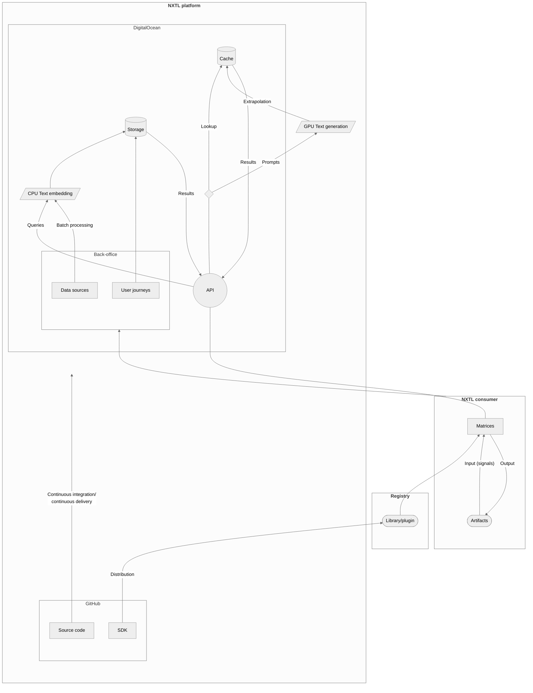

# Architectural overview

```mermaid
%%{init: { "theme": "neutral", "flowchart": {"rankSpacing": 150, "defaultRenderer": "dagre"}} }%%
flowchart BT
subgraph nxtl_consumer [<b>NXTL consumer</b>]
  artifacts([Artifacts])
  matrices[Matrices]
end
subgraph nxtl_platform [<b>NXTL platform</b>]
  text_generation[/GPU Text generation/]
  subgraph digital_ocean [DigitalOcean]
    api((API))
    d{ }
    text_embedding[/CPU Text embedding/]
    storage[(Storage)]
    cache[(Cache)]
    subgraph back_office [Back-office]
      data_sources[Data sources]
      user_journeys[User journeys]
    end
  end
  subgraph github [GitHub]
    source_code[Source code]
    sdk[SDK]
  end
end
subgraph registry [<b>Registry</b>]
  ecosystem([Library/plugin])
end
classDef paddedNode padding:100px
class api paddedNode
sdk -- Distribution --> ecosystem
ecosystem --> matrices
matrices --- api
storage -- Results --> api
cache -- Results --> api
d -- Prompts --> text_generation
api -- Queries --> text_embedding
d -- Lookup --> cache
api --- d
text_generation -- Extrapolation --> cache
text_embedding --> storage
source_code -- Continuous integration/<br />continuous delivery --> digital_ocean
nxtl_consumer --> back_office
data_sources -- Batch processing --> text_embedding
user_journeys --> storage
matrices -- Output --> artifacts
artifacts -- Input (signals) --> matrices
```
