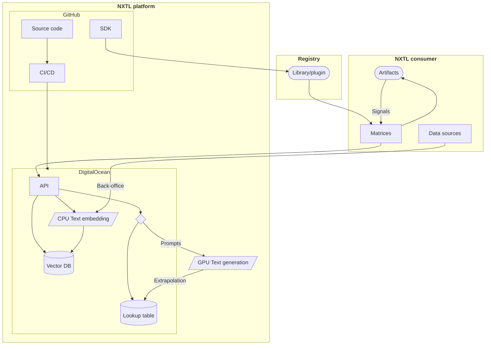

```mermaid
flowchart TD
subgraph nxtl_consumer [<b>NXTL consumer</b>]
  artifacts([Artifacts])
  data_sources[Data sources]
  matrices[Matrices]
end
subgraph nxtl_platform [<b>NXTL platform</b>]
  text_generation[/GPU Text generation/]
  subgraph digital_ocean [DigitalOcean]
    api[API]
    d{ }
    text_embedding[/CPU Text embedding/]
    storage[(Vector DB)]
    cache[(Lookup table)]
  end
  subgraph github [GitHub]
    source_code[Source code]
    sdk[SDK]
    ci_cd[CI/CD]
  end
end
subgraph registry [<b>Registry</b>]
  ecosystem([Library/plugin])
end
sdk --> ecosystem
ecosystem --> matrices
matrices --> api
api --> storage
d -- Prompts --> text_generation
api --> text_embedding
d --> cache
api --> d
text_generation -- Extrapolation --> cache
text_embedding --> storage
ci_cd --> digital_ocean
source_code --> ci_cd
data_sources -- Back-office --> text_embedding
matrices --> artifacts
artifacts -- Signals --> matrices
```
