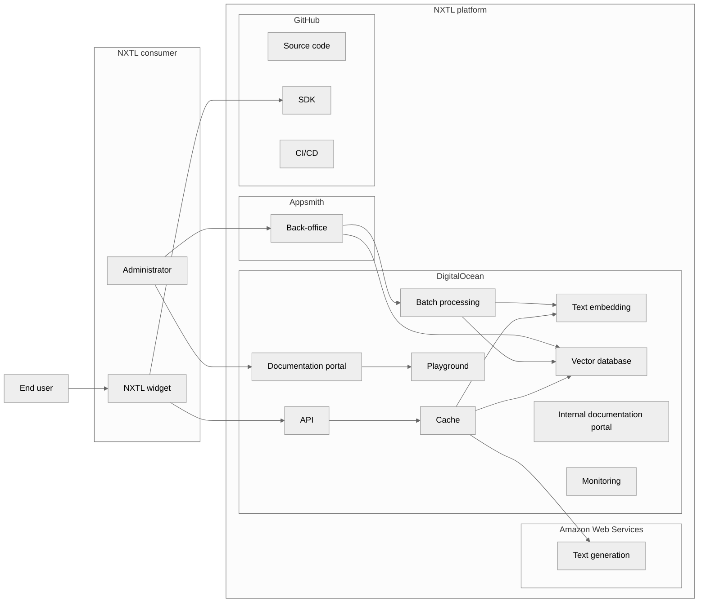

# Architecture

 

```mermaid
%%{init: {'theme':'neutral'}}%%
graph LR;
subgraph EEE [NXTL consumer]
X[NXTL widget];
W[Administrator];
end
Z[End user];
subgraph FFF [NXTL platform]
subgraph AAA [Appsmith]
G[Back-office];
end
subgraph BBB [Amazon Web Services]
D[Text generation];
end
subgraph CCC [DigitalOcean]
B[API];
C[Cache];
E[Text embedding];
F[Vector database];
H[Batch processing];
I[Documentation portal];
J[Playground];
L[Internal documentation portal];
M[Monitoring];
end
subgraph DDD [GitHub]
K[Source code];
Y[SDK];
N[CI/CD];
end
end
X --> B;
B --> C;
C --> D;
C --> E;
C --> F;
G --> H;
W --> G;
H --> F;
H --> E;
G --> F;
W --> I;
I --> J;
Z --> X;
X --> Y;
```
